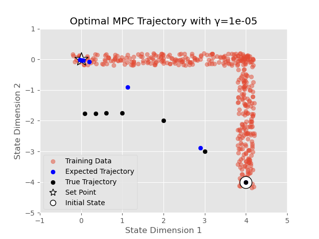
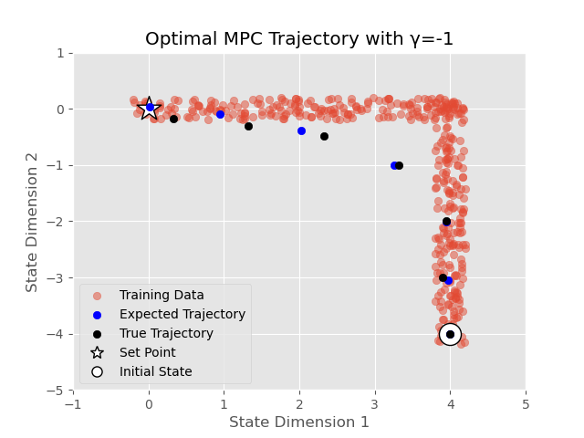

# Gaussian Process Model Predictive Control using PyTorch
This repository is a WIP implementation of an MPC controller which computes an optimal trajectory using a dynamics model
estimated using Gaussian Process Regression (GPR). This MPC is capable of risk-averse and risk-seeking behaviour by 
utilizing the fact that variance estimates of future states can be retrieved using GPR. The degree of risk-aversion is 
controlled by the parameter γ, with the controller becoming more risk-averse as γ becomes more negative, and more 
risk-seeking as γ becomes more positive. Risk-averse behaviour is associated with the controller choosing a trajectory
closer to training data, where we have a more accurate estimate of the dynamics function. Risk-seeking behaviour 
however, is associated with the controller intentionally choosing a trajectory far away from where training
data has been sampled on the state-action space. More information can be found at [1] and [2].

    
    

Below I briefly list some important details concerning my implementation.
* In order to solve for trajectories which minimize the risk-sensitive cost, I use the IPOPT solver using the Python interface cyipopt.
* This code implements a shooting-method controller. Box constraints are only possible on the input variables, not on the states.
* Although the function for computing the covariance between state dimensions is fully implemented, the MPC setup as of now only looks at the variance of state dimensions. This is to reduce runtime.
* So far, I've only got the MPC to run on classic GPR. A sparsified implementation may come later. 

## Citations
[1] Yang, Xiaoke, and Jan Maciejowski. "Risk-sensitive model predictive control with Gaussian process models." IFAC-PapersOnLine 48.28 (2015): 374-379.

[2] Maciejowski, Jan M., and Xiaoke Yang. "Fault tolerant control using Gaussian processes and model predictive control." 2013 Conference on Control and Fault-Tolerant Systems (SysTol). IEEE, 2013.

[3] Quinonero-Candela, Joaquin, Agathe Girard, and Carl Edward Rasmussen. "Prediction at an uncertain input for Gaussian processes and relevance vector machines-application to multiple-step ahead time-series forecasting." (2003).

[4] Candela, Joaquin Quinonero, et al. "Propagation of uncertainty in bayesian kernel models-application to multiple-step ahead forecasting." 2003 IEEE International Conference on Acoustics, Speech, and Signal Processing, 2003. Proceedings.(ICASSP'03).. Vol. 2. IEEE, 2003.

[5] Rasmussen, C.E. and Williams, C.K.I. "Gaussian Processes for Machine Learning." the MIT Press, 2006.
